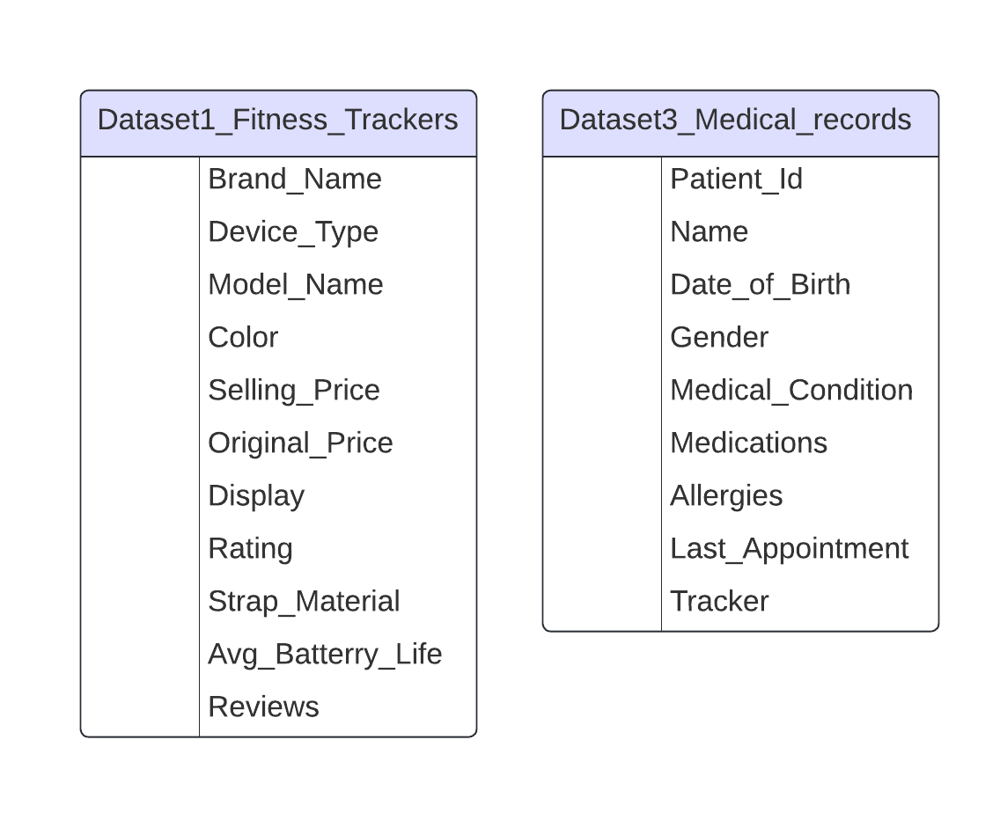
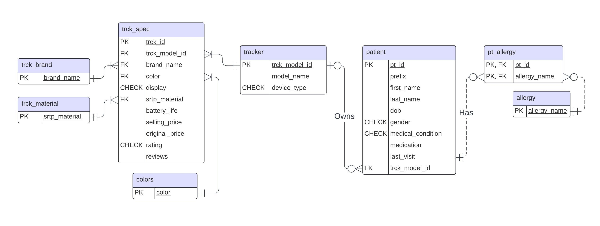
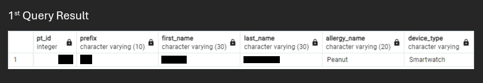
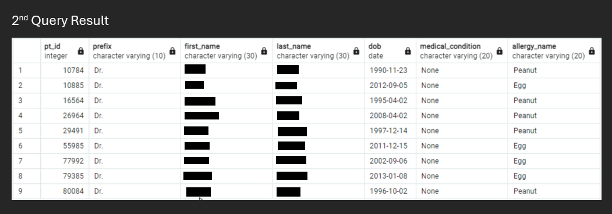
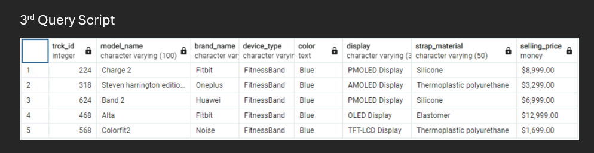
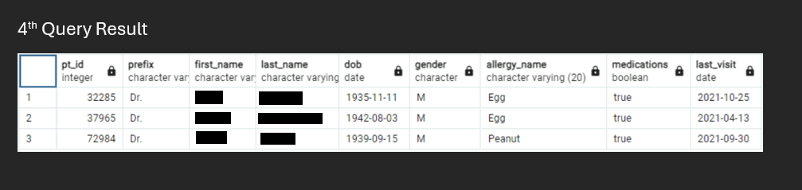
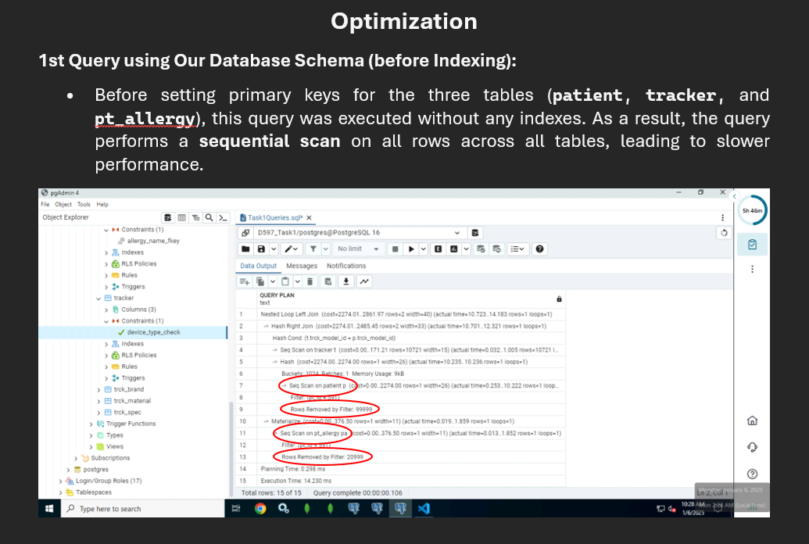
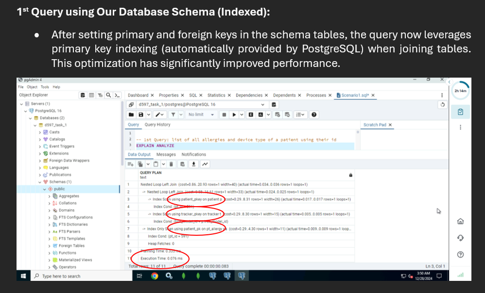
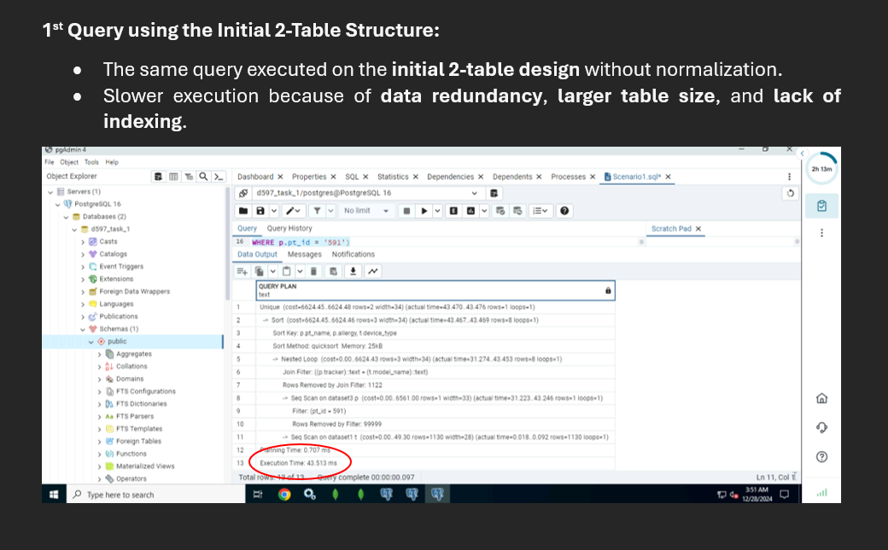

# Relational Database Design — PostgreSQL

This project designs and implements a **normalized relational database** for a health tracking platform managing patient records, allergy histories, and fitness tracker device inventories. The existing data was stored across two flat CSV files with structural violations, duplicate records, and no enforced relationships — making reliable querying, scaling, and security management impractical.

|  |

The project covers full database design from business problem analysis through schema normalization, implementation, query optimization, and role-based access control.

> **Note on Database & Data Availability**
> The PostgreSQL database instance and underlying patient dataset cannot be shared publicly due to the sensitive and proprietary nature of medical and personal health information. This repository contains the full design report, schema documentation, entity-relationship diagrams, and query scripts for portfolio and reference purposes only.

---

## Problem Summary

The original two-table flat structure had the following issues:

- Patient names stored as a single field — not queryable by first/last name
- Multiple allergies stored in one column — violating First Normal Form (1NF)
- Tracker colors and strap materials stored as comma-separated values — violating 1NF
- No foreign key relationships between patients and trackers — no referential integrity
- No constraints, no indexing, no access control

---

## Database Design

### Schema — 8 Tables in Third Normal Form (3NF)

| Table | Purpose |
|---|---|
| `patient` | Personal info, medical condition, medication, assigned tracker |
| `allergy` | All known allergies (lookup table) |
| `pt_allergy` | M:N bridge — patients to their allergies |
| `tracker` | Unique tracker models (model name + device type) |
| `trck_spec` | Full tracker specifications per model (color, brand, price, rating) |
| `colors` | Available tracker colors (lookup table) |
| `trck_brand` | Tracker brands (lookup table) |
| `trck_material` | Strap materials (lookup table) |

### Entity-Relationship Diagram

| ERD |
|---|
|  |

### Key Design Decisions

- **Surrogate key** used for `trck_spec` instead of a composite key across brand/color/display/material — simplifies joins and improves query performance
- **Value-as-primary-key** used for lookup tables (`colors`, `trck_brand`, `trck_material`) — eliminates unnecessary ID-to-name joins in queries
- **Check constraints** used for low-cardinality attributes (`gender`, `medical_condition`, `device_type`, `display`) instead of separate lookup tables — avoids over-engineering for fields unlikely to expand
- **Unique constraint** on `(brand_name, color, display, strp_material)` in `trck_spec` prevents duplicate records despite using a surrogate key

---

## Data Cleaning

Before populating the schema, raw data from two imported CSVs (565 patient rows + 100,000 tracker rows) was cleaned using:

- Trimming leading/trailing whitespace from all string fields
- Capitalizing first letter of each word for consistency
- Correcting misspellings (`"Bleu"` → `"Blue"`, `"Grey"` → `"Gray"`) using `fuzzystrmatch` extension (Soundex / Levenshtein distance)
- Removing duplicate rows caused by case inconsistencies or typos
- Enforcing validation rules through check and unique constraints at insert time

---

## Business Queries

Four business queries were implemented and optimized:

| # | Query | Purpose |
|---|---|---|
| 1 | Emergency Allergy & Tracker Lookup | Retrieve a patient's full allergy list and tracker device by patient ID |
| 2 | Insurance Promotion Eligibility | Find Doctor patients born after 1990 allergic to Egg or Peanut |
| 3 | Tracker Recommendation Engine | Top 5 rated trackers matching a patient's device type, color preference, and price range |
| 4 | Medication Reminder Targeting | Male Doctor patients over 50, with specific allergies, not visited since 2022 |

### Query Scripts

| Query 1 | Query 2 |
|---|---|
|  |  |

| Query 3 | Query 4 |
|---|---|
|  |  |

---

## Query Optimization

Each query was benchmarked before and after indexing against both the normalized schema and the original flat two-table structure.

### Indexing Strategy

| Query | Index Applied | Impact |
|---|---|---|
| Q1 | Primary + foreign keys (auto-indexed) | Sequential scan eliminated |
| Q2 | Composite index on `(date_of_birth, prefix)` | 99,997 → targeted row access |
| Q3 | Index on `(color, selling_price)` in `trck_spec` | Full scan replaced with bitmap index scan |
| Q4 | Index on `(date_of_birth, last_visit, prefix)` | Scanned rows reduced from 257 → 73 |

### Execution Plan Comparisons

| Before Indexing | After Indexing | Flat Table Baseline |
|---|---|---|
|  |  |  |

---

## Security & Access Control

Three roles defined with least-privilege access:

| Role | Permissions |
|---|---|
| `admin` | Full access to all tables and operations |
| `doctor` | SELECT all tables; INSERT + UPDATE on `patient`, `allergy`, `pt_allergy` |
| `technician` | SELECT + INSERT + UPDATE on `tracker`, `trck_spec`, `colors`, `trck_brand`, `trck_material` |

Additional security measures: encrypted backups, scheduled recovery audits, and role-based access control (RBAC) enforced at the database level.

